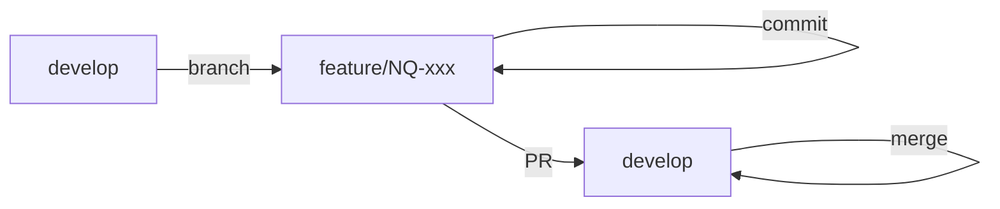
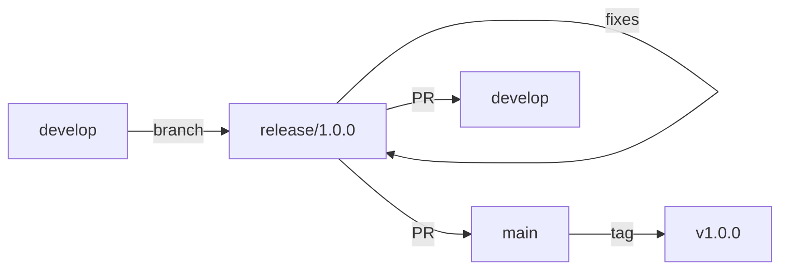
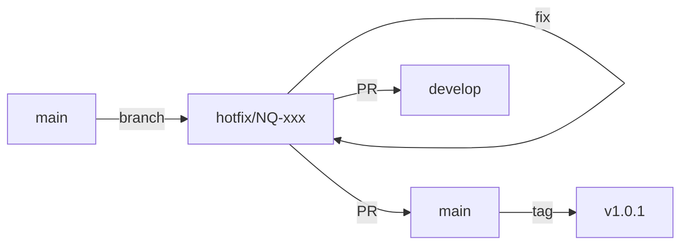

# Nexus Queue - Branch Strategy

This document outlines the branching strategy for the Nexus Queue monorepo, designed to support structured development from POC through production.

---

## Branch Structure Overview

```
main
 │
 ├── develop
 │    │
 │    ├── feature/NQ-xxx-description
 │    ├── feature/NQ-xxx-description
 │    └── ...
 │
 ├── release/x.x.x
 │
 └── hotfix/NQ-xxx-description
```

---

## Branch Types

| Branch Type | Pattern | Base | Merges To | Purpose |
|-------------|---------|------|-----------|---------|
| **main** | `main` | - | - | Production-ready code, tagged releases |
| **develop** | `develop` | main | main (via release) | Integration branch for features |
| **feature** | `feature/NQ-xxx-description` | develop | develop | New features and enhancements |
| **bugfix** | `bugfix/NQ-xxx-description` | develop | develop | Non-critical bug fixes |
| **release** | `release/x.x.x` | develop | main + develop | Release preparation and stabilization |
| **hotfix** | `hotfix/NQ-xxx-description` | main | main + develop | Critical production fixes |

---

## Branch Naming Conventions

### Format
```
<type>/NQ-<ticket>-<short-description>
```

### Examples
```bash
feature/NQ-101-websocket-reconnection
feature/NQ-102-agent-dashboard
bugfix/NQ-103-task-timeout-calculation
hotfix/NQ-104-connection-memory-leak
release/1.0.0
```

### Rules
- Use lowercase letters, numbers, and hyphens only
- Keep descriptions concise (3-5 words max)
- Always include ticket number when available
- For work without tickets, use descriptive slug: `feature/add-pull-mode-support`

---

## Workflow Details

### Feature Development



**Steps:**
1. Create feature branch from `develop`
   ```bash
   git checkout develop
   git pull origin develop
   git checkout -b feature/NQ-101-websocket-reconnection
   ```

2. Develop and commit with conventional commits
   ```bash
   git commit -m "feat(gateway): add automatic reconnection logic"
   git commit -m "test(gateway): add reconnection unit tests"
   ```

3. Push and create Pull Request to `develop`
   ```bash
   git push -u origin feature/NQ-101-websocket-reconnection
   ```

4. After PR approval, squash merge to `develop`

---

### Release Process



**Steps:**
1. Create release branch from `develop`
   ```bash
   git checkout develop
   git pull origin develop
   git checkout -b release/1.0.0
   ```

2. Update version numbers
   ```bash
   # Update package.json versions
   npm version 1.0.0 --no-git-tag-version
   git commit -am "chore(release): bump version to 1.0.0"
   ```

3. Stabilization period - only bug fixes allowed
   ```bash
   git commit -m "fix(workspace): correct layout overflow issue"
   ```

4. Create PR to `main`, merge, and tag
   ```bash
   git tag -a v1.0.0 -m "Release 1.0.0"
   git push origin v1.0.0
   ```

5. Back-merge release branch to `develop`

---

### Hotfix Process



**Steps:**
1. Create hotfix branch from `main`
   ```bash
   git checkout main
   git pull origin main
   git checkout -b hotfix/NQ-104-connection-memory-leak
   ```

2. Apply fix and bump patch version
   ```bash
   git commit -m "fix(socket): resolve memory leak on disconnect"
   npm version patch --no-git-tag-version
   git commit -am "chore(release): bump version to 1.0.1"
   ```

3. PR to `main`, merge, tag, then PR to `develop`

---

## Commit Message Convention

Follow [Conventional Commits](https://www.conventionalcommits.org/) specification:

```
<type>(<scope>): <description>

[optional body]

[optional footer]
```

### Types

| Type | Description |
|------|-------------|
| `feat` | New feature |
| `fix` | Bug fix |
| `docs` | Documentation only |
| `style` | Code style (formatting, semicolons, etc.) |
| `refactor` | Code change that neither fixes a bug nor adds a feature |
| `perf` | Performance improvement |
| `test` | Adding or correcting tests |
| `chore` | Build process, dependencies, or auxiliary tools |
| `ci` | CI/CD configuration |

### Scopes (Nexus Queue Specific)

| Scope | Description |
|-------|-------------|
| `workspace` | Agent Workspace app (`apps/agent-workspace`) |
| `api` | API Server app (`apps/api-server`) |
| `gateway` | WebSocket gateway |
| `models` | Shared models library |
| `auth` | Authentication/authorization |
| `queue` | Queue management logic |
| `stage` | iFrame Stage component |
| `actions` | Action bar components |

### Examples
```bash
feat(gateway): implement task timeout handling
fix(workspace): resolve header overflow on mobile
docs(models): add JSDoc comments to Task interface
refactor(queue): extract state machine to separate service
test(api): add integration tests for task endpoints
chore(deps): update Angular to v17.1
```

---

## Pull Request Guidelines

### PR Title Format
```
<type>(<scope>): <description> [NQ-xxx]
```

### PR Template
```markdown
## Summary
Brief description of changes (2-3 bullet points)

## Changes
- Detailed list of modifications
- Include file paths for significant changes

## Testing
- [ ] Unit tests added/updated
- [ ] Integration tests pass
- [ ] Manual testing completed

## Screenshots (if UI changes)

## Related Issues
Closes NQ-xxx
```

### Merge Strategy

| Target Branch | Merge Type | Reason |
|---------------|------------|--------|
| develop | Squash | Clean history, single commit per feature |
| main | Merge commit | Preserve release history |
| develop (from hotfix) | Merge commit | Preserve fix history |

---

## Protected Branch Rules

### main
- Require PR with 1+ approvals
- Require status checks to pass
- No direct pushes
- No force pushes
- Include administrators

### develop
- Require PR with 1+ approvals
- Require status checks to pass
- No direct pushes
- Allow force pushes for maintainers (rebase cleanup)

---

## CI/CD Integration

### Branch-Triggered Pipelines

| Branch Pattern | Pipeline Actions |
|----------------|------------------|
| `feature/*`, `bugfix/*` | Lint, Test, Build |
| `develop` | Lint, Test, Build, Deploy to DEV |
| `release/*` | Lint, Test, Build, Deploy to STAGING |
| `main` | Lint, Test, Build, Deploy to PROD |
| `hotfix/*` | Lint, Test, Build |

### Required Status Checks
```yaml
- nx-lint
- nx-test
- nx-build-api-server
- nx-build-agent-workspace
```

---

## Version Strategy

Follow [Semantic Versioning](https://semver.org/):

```
MAJOR.MINOR.PATCH
```

| Increment | When |
|-----------|------|
| MAJOR | Breaking changes to API or significant architectural shifts |
| MINOR | New features, backward-compatible |
| PATCH | Bug fixes, backward-compatible |

### Current Version Tracking
- Tracked in root `package.json`
- Individual app versions in `apps/*/project.json` (optional)
- Tagged on `main` branch: `v1.0.0`, `v1.1.0`, etc.

---

## Quick Reference Commands

```bash
# Start new feature
git checkout develop && git pull origin develop
git checkout -b feature/NQ-xxx-description

# Start hotfix
git checkout main && git pull origin main
git checkout -b hotfix/NQ-xxx-description

# Update feature branch with latest develop
git checkout feature/NQ-xxx-description
git fetch origin develop
git rebase origin/develop

# Push branch
git push -u origin <branch-name>

# Delete local branch after merge
git branch -d feature/NQ-xxx-description

# Delete remote branch after merge
git push origin --delete feature/NQ-xxx-description
```

---

## Migration from Current State

Since we're transitioning from initial POC development:

1. **Immediate**: Create `develop` branch from current `main`
   ```bash
   git checkout main
   git pull origin main
   git checkout -b develop
   git push -u origin develop
   ```

2. **Configure**: Set up branch protection rules in GitHub

3. **Adopt**: All new work follows this strategy starting now

---

## Summary Diagram

```
                    ┌─────────────────────────────────────────────────┐
                    │                     main                         │
                    │            (production releases)                 │
                    └──────────────────────┬──────────────────────────┘
                                           │
            ┌──────────────────────────────┼──────────────────────────┐
            │                              │                          │
            ▼                              ▼                          ▼
     ┌─────────────┐              ┌─────────────┐              ┌─────────────┐
     │   hotfix/   │              │   release/  │              │   develop   │
     │  NQ-xxx-... │              │    x.x.x    │              │             │
     └─────────────┘              └─────────────┘              └──────┬──────┘
                                                                      │
                                           ┌──────────────────────────┼──────────────────────────┐
                                           │                          │                          │
                                           ▼                          ▼                          ▼
                                    ┌─────────────┐            ┌─────────────┐            ┌─────────────┐
                                    │  feature/   │            │  feature/   │            │   bugfix/   │
                                    │  NQ-101-... │            │  NQ-102-... │            │  NQ-103-... │
                                    └─────────────┘            └─────────────┘            └─────────────┘
```

---

*Last Updated: February 2026*
*Version: 1.0*
